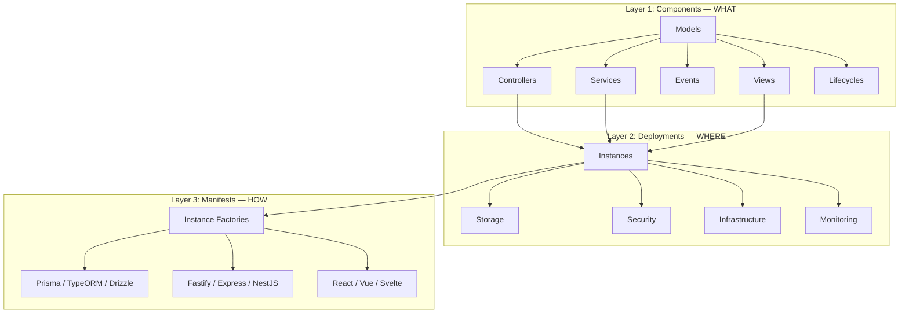
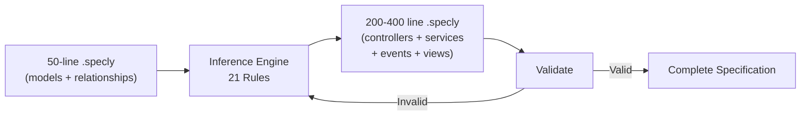

<!-- Source: ~/tmp/SPECVERSE-INTRODUCTION-V4.md (sections 5-6) -->

# Specification Architecture

A SpecVerse specification describes a system at three levels of abstraction, and a deterministic inference engine expands minimal definitions into complete architectures.

## Three Architectural Layers



**Components** (Layer 1) define what the system does: data models with attributes and relationships, controllers with CURVED operations (Create, Update, Retrieve, Retrieve_many, Validate, Evolve, Delete), services with business logic and event subscriptions, views with UI specifications, and lifecycles governing entity state transitions.

**Deployments** (Layer 2) define where it runs: storage instances (databases, caches, queues), security (authentication, authorisation, encryption), infrastructure (gateways, load balancers, CDN), and monitoring (metrics, logging, tracing, alerting).

**Manifests** (Layer 3) define how it is built: instance factories bind abstract capabilities to concrete technologies. The same spec can generate different technology stacks by changing the manifest, not the spec.

## A Minimal Example

```yaml
components:
  BlogSystem:
    version: "3.5.0"
    models:
      Post:
        attributes:
          title: String required
          content: String required
          author: String required
        lifecycles:
          publication:
            flow: draft -> published -> archived
      Comment:
        attributes:
          content: String required
        relationships:
          post: belongsTo Post
```

From these 16 lines, the inference engine generates: PostController and CommentController with full CURVED operations, PostService and CommentService with event subscriptions, lifecycle events (PostPublished, PostArchived), CURVED events (PostCreated, CommentDeleted), and list/detail/form views for both models. The 16-line input becomes a ~80-line complete architecture.

## How Specifications Expand

Between a minimal human specification and a complete architecture sits the inference engine: 21 deterministic rules that expand models into controllers, services, events, and views.



This is not AI in the LLM sense — it is codified architectural knowledge. The term "inference" here means rule-based deduction, not large language model inference. Examples of rules:

- "Every model with a lifecycle gets an `evolve` operation."
- "Every `hasMany` relationship generates cascade delete handling."
- "Every model gets list, detail, and form views."

The output is predictable, testable, and version-controlled. The engine operates purely on the specification format — it reads the three architectural layers, applies its rules, and produces a complete specification that can be validated against the schema.

This is what enables the **4x–7.6x expansion ratios** measured in practice: a 50-line input describing models and relationships becomes a 200–400 line specification covering the full architecture.

---

**Next:** See how all these pieces fit together in [The Ecosystem](./ecosystem.md) — the tools, platforms, and components built around the .specly file.
