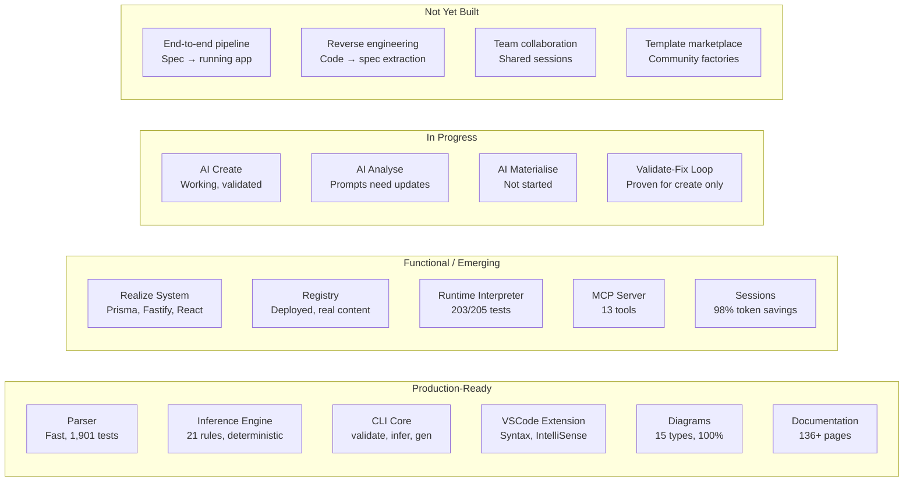

<!-- Source: ~/tmp/SPECVERSE-INTRODUCTION-V4.md (Appendix B) -->

# Component Status

## Maturity Overview

## Detailed Status

| Component | Maturity | Evidence |
|-----------|----------|---------|
| Parser + Schema | Production | Fast parsing, 1,901 tests, convention processing |
| Inference Engine | Production | 21 rules, 4x–7.6x expansion, deterministic |
| CLI (core commands) | Production | validate, infer, gen, init, migrate |
| VSCode Extension | Production | Syntax, IntelliSense, validation, diagram preview |
| Diagram Generator | Production | 15 Mermaid types, 100% complete |
| Documentation Site | Production | 136+ pages, auto-sync, Docusaurus v3 |
| TypeScript API | Production | Programmatic access, verified examples |
| MCP Server | Functional | 7 core + 6 orchestrator tools, multi-environment |
| Realize System | Functional | Instance factories for Prisma, Fastify, React |
| Registry Platform | Functional | Deployed on Vercel, real libraries, 49 API tests |
| Runtime Interpreter | Functional | 7-tab UI, multi-server, 203/205 tests |
| Session Management | Functional | Claude Code integration, 98% token savings |
| AI Create (Pillar 2) | Validated | 4x–7.6x measured, validate-fix loop working |
| AI Analyse (Pillar 3) | Early | Prompts exist, need updating |
| AI Materialise/Realize (Pillar 4) | Not started | Framework and infrastructure ready |
| End-to-end pipeline | Not built | No spec → running app single command |
| Code → spec extraction | Not built | Cannot yet reverse-engineer existing systems |

---

**See also:** [The Ecosystem](./ecosystem.md) for detailed descriptions of each component, or [Language Coverage](./language-coverage.md) for what the specification language covers.
