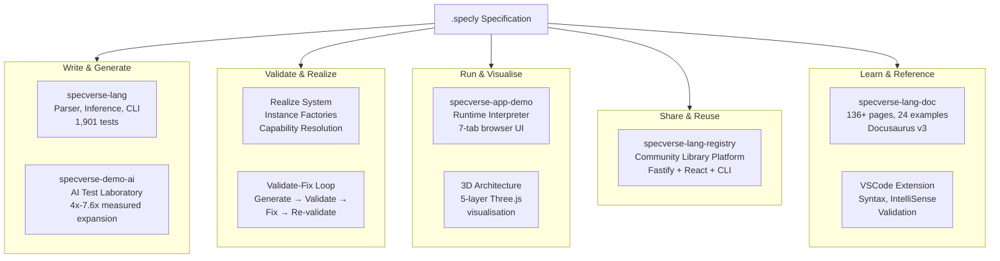
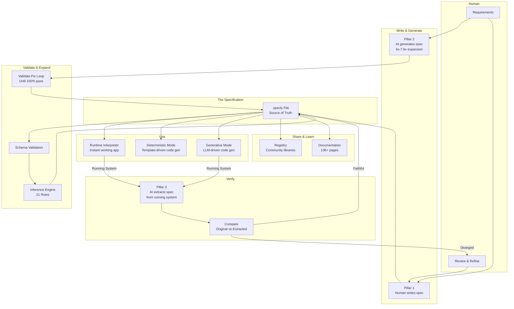

<!-- Source: ~/tmp/SPECVERSE-INTRODUCTION-V4.md (sections 7, 9, 10) -->

# The Ecosystem

SpecVerse is not just a language — it is a complete platform built around the .specly file as the central artifact. Every component reads, writes, validates, interprets, or shares specifications.



## specverse-lang — The Core Language

The heart of the ecosystem. Contains the parser, inference engine, CLI, code generation system, and all language definitions.

- **Parser**: Fast YAML + Conventions processing with JSON Schema validation. Conventions like `email: Email required unique verified` expand into structured type definitions automatically.
- **Inference Engine**: 21 deterministic rules that expand minimal models into complete architectures (controllers, services, events, views). Produces 4x–7.6x spec expansion depending on system complexity.
- **CLI**: 30+ commands spanning core operations (validate, infer, gen), code realisation (realize orm/services/routes), AI workflows (ai template analyse/create/materialise/realize), session management, and registry integration.
- **Realize System**: Manifest-driven code generation. Instance factories (Prisma, Fastify, React) are resolved via capability mapping, so the same spec generates different tech stacks by changing the manifest.
- **VSCode Extension**: Full syntax highlighting, IntelliSense, real-time validation, and diagram preview for .specly files.
- **MCP Server**: Model Context Protocol server enabling AI assistant integration across Claude Desktop, web interfaces, and enterprise environments. 7 core tools + 6 orchestrator tools for specification creation, analysis, validation, and implementation prompting.
- **Diagram Generator**: 15 Mermaid diagram types covering ER relationships, lifecycle state machines, event flows, architecture layers, deployment topology, capability bindings, and technology stacks.
- **Documentation Generator**: Auto-generates comprehensive documentation from specifications.
- **TypeScript API**: Full programmatic access for building custom tools, IDE integrations, and build pipelines.
- **1,901 tests** across 5 tiers: parser, grammar, examples, inference, and CLI.

## specverse-app-demo — The Runtime Interpreter

A full-stack application that **executes .specly files at runtime without compilation**. Load a specification and instantly get a working application with REST API, WebSocket events, web UI, and in-memory database — all dynamically generated from the spec.

```
blog.specly → Parser → RuntimeEngine → Working Application
                                        ├── REST API (CURVED operations)
                                        ├── WebSocket (real-time events)
                                        ├── Web UI (7 tabs)
                                        ├── State Machines (lifecycles)
                                        └── In-Memory Database
```

**Seven browser tabs**: Models (CURVED interface with relationship dropdowns and lifecycle transitions), Views (custom dashboards and forms from spec), Events (live event stream), Diagrams (auto-generated Mermaid), 3D Graph (interactive Three.js architecture visualisation across 5 layers), Specly (live editor with hot reload), Help (built-in docs).

**Multi-server mode**: A manager UI orchestrates multiple spec servers simultaneously — upload .specly files through the browser, each runs on its own port.

This proves a key claim: a .specly specification is **precise enough to execute directly**. The spec is not just a design document — it contains enough information to create a working application. This provides the fastest possible feedback loop: write spec → see running app → modify spec → hot reload.

Built with Express, React, Vite, Tailwind, React Query, and Three.js. 203/205 tests passing.

## specverse-demo-ai — The AI Testing Laboratory

A comprehensive test suite proving that SpecVerse's AI workflow actually works, with measurable quality metrics. Three generations of testing frameworks, culminating in an automated system that validates AI-generated specifications against hard benchmarks.

**Four test operations**:

| Operation | What It Tests | Result |
|-----------|---------------|--------|
| demo-create | AI generates spec from simple requirements | 40 lines → 200 lines (4x expansion) |
| pro-create | AI generates spec from enterprise requirements | 80 lines → 3,600+ lines (7.6x expansion) |
| demo-analyse | AI extracts spec from clean codebase | In progress |
| pro-analyse | AI extracts spec from production code | In progress |

**The scale recognition story**: The same language format handles radically different scales. The inference engine does not just produce more lines at enterprise scale — it recognises the *kind* of system being described and generates architecturally appropriate patterns. Multi-tenancy appears only when multiple organisations are described. RBAC appears only when role hierarchies are specified. International support appears only when multiple countries are mentioned.

**The validate-fix loop**: Generate → validate against schema → fix errors automatically → re-validate until 100% pass. Combined with session caching (98% token savings, ~$0.40/generation), this makes AI-assisted specification development both reliable and economical.

## specverse-lang-registry — The Community Library Platform

A production-deployed registry for sharing and discovering reusable .specly specifications — think npm for specifications.

```yaml
# Use community libraries in your specs
import:
  - from: "@specverse/auth"
    select: [User, AuthController]
  - from: "@specverse/commerce"
    select: [Product, Order, OrderItem]
```

**Three components in a monorepo**:
- **API** (Fastify): 25+ endpoints, GitHub OAuth, server-side .specly validation, PostgreSQL/Prisma, download tracking, star system. Deployed on Vercel.
- **Web UI** (React + Vite): Browse libraries with tag/type/category filtering, publish with drag-and-drop upload, version history, README display.
- **CLI** (@specverse/reg on npm): 8 commands for login, publish, search, info, star/unstar. Device flow OAuth for terminal authentication.

**Integration with specverse-lang CLI**:
```bash
specverse lib search authentication       # Search by keyword
specverse lib search --tags auth,oauth    # Search by tags
specverse lib info @specverse/auth        # Get library details
specverse lib tags                        # Browse categories
```

Import resolution checks the registry before local files, caches results locally, and falls back gracefully when offline.

**Published libraries** include authentication patterns, e-commerce models, REST API conventions, event-driven architecture templates, and domain-specific models for company and retail commerce.

**Meta-story**: The registry itself was designed from a 719-line .specly specification (`spec/registry.specly`), serving as both the community hub and a real-world validation of specification-driven architecture.

## specverse-lang-doc — Documentation & Learning

136+ pages of Docusaurus v3 documentation covering the complete SpecVerse language, tooling, and ecosystem.

**Content spans**: 7 getting started pages, 18 language reference pages, 60+ example pages (24 core examples progressing from basic models to full enterprise architectures), 6 registry pages, 15 reference pages, and 8 tool pages.

**Automatic sync**: A 515-line script synchronises documentation from specverse-lang — examples, diagrams, metadata, sidebar configuration — ensuring docs stay current as the language evolves.

## What Makes This Different

There are many specification languages (OpenAPI, AsyncAPI, Terraform, Pulumi) and many AI coding tools (Cursor, Copilot, Windsurf). SpecVerse occupies a different space:

**It is not a code generator.** It is a format for expressing software architecture that happens to be implementable. The specification is the artifact, not the generated code. The runtime interpreter proves this: load a .specly file and get a running application without generating a single line of code.

**It is not an API spec.** OpenAPI describes HTTP endpoints. SpecVerse describes entire systems — models, business logic, events, UI, deployment, and the relationships between them.

**It is not an IaC tool.** Terraform describes infrastructure. SpecVerse describes applications and maps them onto infrastructure through its deployment and manifest layers.

**It is not a solo tool.** The registry enables community sharing of proven specification patterns. Import authentication, e-commerce, or domain models instead of writing them from scratch.

**It is a human-AI interface.** The specification format is designed so that humans can write it (Pillar 1), AI can generate it (Pillar 2), AI can extract it from existing systems (Pillar 3), and AI can implement from it (Pillar 4). No other tool is designed for all four.

The bet is that as AI becomes central to software development, the bottleneck shifts from "writing code" to "communicating intent precisely." SpecVerse is purpose-built for that world: one format, one source of truth, readable by humans, writable by machines, verifiable by both.

## The Full Picture



Everything revolves around the .specly file. It is written by humans and AI. It is validated, expanded, and inferred. It is executed at runtime, realised into code, and shared through the registry. It is extracted from running systems and compared against the original intent.

---

**See also:** [Language Coverage](./language-coverage.md) for what .specly expresses today and the roadmap ahead, or [Component Status](./component-status.md) for the maturity of each ecosystem piece.
