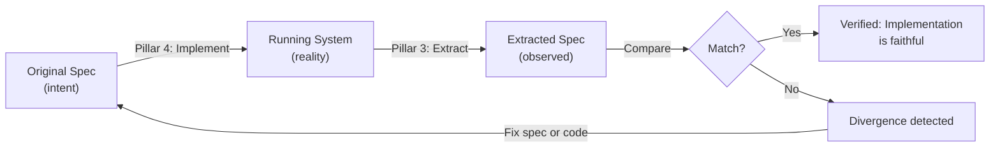
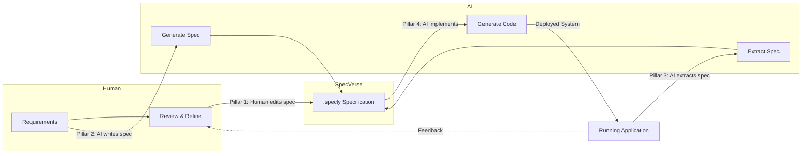

<!-- Source: ~/tmp/SPECVERSE-INTRODUCTION-V4.md (section 4: The Structure) -->

# The Four Pillars

The SpecVerse philosophy manifests through four structural capabilities — four directions that specifications can flow between humans and machines.

## Pillar 1: Human-Writable

Developers write specifications naturally using YAML with convention shortcuts:

```yaml
models:
  User:
    attributes:
      email: Email required unique verified
      name: String required
      role: String default=member values=[member, admin, moderator]
    lifecycles:
      account:
        flow: pending -> active -> suspended -> deleted
```

No special tools required. Any developer who can read YAML can read and modify a SpecVerse specification. Conventions like `Email required unique verified` expand into structured schema definitions automatically.

## Pillar 2: AI-Writable

An AI system receives a natural language request — "build me a property management system with bookings, guest profiles, and multi-property support" — and generates a complete, valid specification. The specification is validated against the SpecVerse schema, and any errors are automatically fixed through the validate-fix loop until the spec passes 100%.

## Pillar 3: AI-Describable

An AI system examines an existing codebase — routes, database schemas, UI components — and extracts a specification describing what that system does. This creates an adoption path with zero risk: try SpecVerse on your existing code before committing to it.

## Pillar 4: AI-Implementable

A SpecVerse specification is precise and structured enough that an AI system can generate a working implementation from it — database schemas, API routes, service logic, UI components — targeting whatever technology stack is specified in the manifest.

## The Closed Loop: Verification Through Round-Trip

The four pillars are not just independent capabilities — they form a **verification loop**:



After an AI implements a system from a spec (Pillar 4), Pillar 3 can extract a spec from the running implementation and compare it against the original. If they match, the implementation is faithful to intent. If they diverge, you can see exactly where and decide whether to fix the code or update the spec.

This closes the loop that traditional specification approaches left open. The spec does not drift from reality because alignment can always be verified — and the spec format is structured enough that comparison is meaningful, not just a text diff.

## The Workflow

The four pillars combine into a continuous cycle:



The specification is always the source of truth. Humans and AI both read it, both write it, and the system stays in sync.

---

**Next:** Understand the [Specification Architecture](./architecture.md) — the three layers inside a .specly file and how the inference engine expands them.
