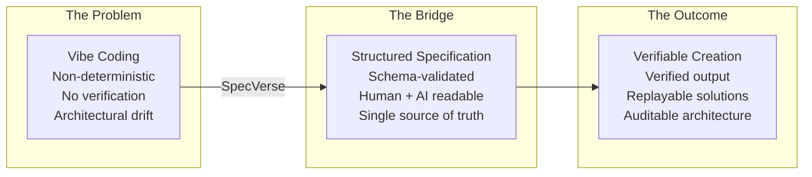
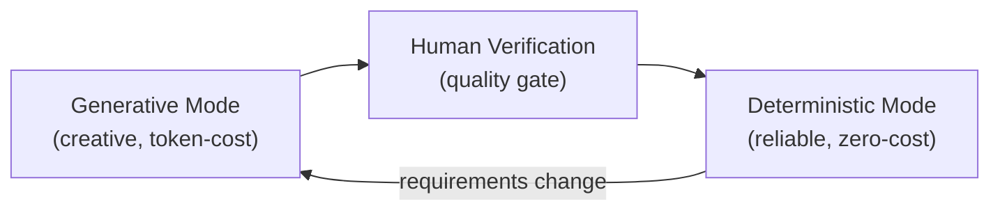

<!-- Source: ~/tmp/SPECVERSE-INTRODUCTION-V4.md (sections 1-3) -->

# What is SpecVerse?

> **Intent Is All You Need**

SpecVerse is a structured format for describing software systems — one that is **precise enough for machines** but **natural enough for humans**, that can be **verified automatically**, and that stays **connected to implementation** because it *is* the implementation's source of truth.

## The Problem: Why SpecVerse Exists

Software development is being transformed by AI. Developers describe what they want in natural language, and AI generates code. This is fast, flexible, and increasingly capable. It is also fundamentally unreliable.

### The Vibe Coding Trap

AI coding tools — Cursor, Copilot, Windsurf, Claude Code — generate code from loose prompts. The same prompt produces different results on different days. There is no schema validating the output against the intent, no way to verify the generated system matches what was asked for, and no mechanism to replay a successful generation reliably.

The faster code is generated, the faster **architectural drift** accumulates — the gap between what was intended and what was built. Every AI-generated function that is "close enough" compounds the problem. What starts as a productivity boost becomes a maintenance liability, because nobody can point to a single document and say "this is what the system is supposed to do."

This is vibe coding: it feels productive, but there is no structural guarantee that what is built matches what was wanted.

### The Limits of Traditional Specification

Previous attempts to solve this problem — UML, formal methods, Model-Driven Architecture — failed for the opposite reason. They were precise but impractical:

- **Too rigid**: Specifications could not evolve at the pace of development
- **Too complex**: Learning the specification language was harder than writing the code
- **Disconnected from implementation**: The spec and the code were separate artifacts, so one always drifted from the other
- **Write-once**: Specs were created at the start and abandoned once coding began
- **Not designed for AI consumption**: Traditional specifications were created for human readers alone. They cannot be reliably parsed, generated, or reasoned about by AI agents — making them unusable in modern agentic workflows

The result: specifications became shelf-ware. Nobody maintained them because maintaining a spec *and* the code was double the work with no enforced connection between them.

## The Insight: Verifiable Creation

The core insight behind SpecVerse is that AI-generated software does not have to be non-deterministic. The problem is not that AI generates code — it is that AI generates code **without a verifiable specification to check against**.

If there were a structured format that captured architectural intent — one that both humans and AI could read and write — then:

1. **AI generation becomes verifiable**: Generate a spec, validate it against a schema. Pass or fail. No ambiguity.
2. **Proven solutions become replayable**: When an AI solves a problem well, capture the solution as a deterministic template. Replay it reliably forever — zero tokens, near-instant execution, identical output every time.
3. **Architecture becomes auditable**: The spec is the source of truth. Compare the running system against the spec. If they match, the implementation is faithful. If they diverge, you can see exactly where.

This is the shift from **non-deterministic generation to verifiable creation**: AI explores non-deterministically, humans verify, and proven solutions crystallise into deterministic, replayable artifacts.

### Two Modes of Operation

SpecVerse implements this through a two-mode system:

**Generative mode** (the `ai template` command): An LLM generates a solution — a specification, a code template, a deployment configuration. The output is validated against the SpecVerse schema. Errors are automatically fixed through a validate-fix loop until the spec passes 100%. This costs tokens and takes seconds, but produces verified output.

**Deterministic mode** (the `realize` command): A proven solution is captured as an **instance factory** — a deterministic template generator stored in version control. Execution is deterministic, near-instant, costs nothing, and produces identical output every time.

Solutions graduate from generative to deterministic as they mature. When requirements change, they return to generative mode, get re-verified, and are re-captured:

The instance factory templates in SpecVerse — ORM schema generators, API route generators, UI component generators — are themselves **distilled LLM knowledge**: the best solution an AI produced, verified by a human, crystallised for reliable reuse.

## The Philosophy

> **Structured intent as the single source of truth.**

Software architecture should be expressed in a single, structured format that serves as the source of truth for both humans and machines. A SpecVerse specification is:

- **Readable** by any developer who can read YAML
- **Writable** by humans and AI systems alike
- **Verifiable** against a formal schema — pass or fail, no ambiguity
- **Precise enough** to generate implementations from, or to execute directly at runtime
- **Extractable** from existing codebases, creating a zero-risk adoption path

It captures the *what* and *why* of a system without dictating the *how*. The same specification can target different ORMs, web frameworks, or UI libraries — technology choices are made in the manifest, not the spec.

---

**Next:** Learn about the [Four Pillars](./four-pillars.md) that make SpecVerse work — the four directions specifications flow between humans and machines.
