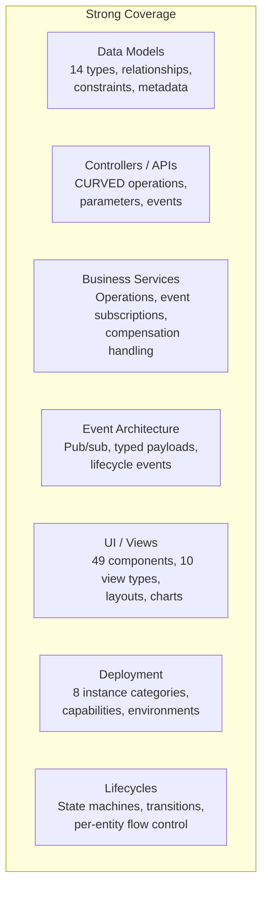
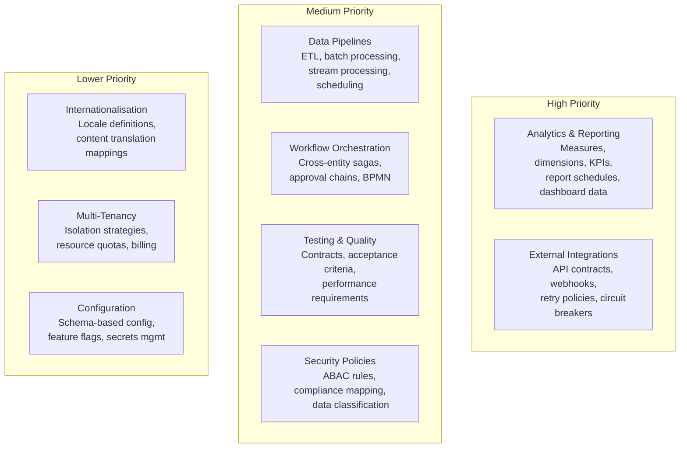

<!-- Source: ~/tmp/SPECVERSE-INTRODUCTION-V4.md (section 8 + Appendix A) -->

# Language Coverage

## What .specly Expresses Today

These domains have well-defined schema primitives, inference rules, and tooling support:



**What this enables**: SaaS applications, entity-centric systems, booking platforms, CMS platforms, project management tools, e-commerce storefronts — any system primarily concerned with entities, their lifecycles, and CURVED operations.

## Roadmap

The .specly format is designed to be extensible. The following domains are planned additions — they require new schema primitives and inference rules, not architectural changes to the format itself.

| Specification Domain | Coverage | Priority |
|---------------------|----------|----------|
| Data Models & Relationships | Complete | — |
| Controllers / CURVED APIs | Complete | — |
| Business Services & Events | Complete | — |
| UI Views & Components | Complete | — |
| Lifecycle State Machines | Complete | — |
| Deployment Infrastructure | Complete | — |
| **Analytics & Reporting** | **Planned** | **High** |
| **External Integrations** | **Planned** | **High** |
| **Data Pipelines** | **Planned** | **Medium** |
| **Workflow Orchestration** | **Planned** | **Medium** |
| Testing & Quality Contracts | Planned | Medium |
| Security Policies (ABAC) | Minimal | Medium |
| Internationalisation | Planned | Low |
| Multi-Tenancy (explicit) | Minimal | Low |
| Configuration Management | Minimal | Low |

The language is excellent for its core domain. The path to a universal specification language requires incremental expansion — adding schema primitives and inference rules for each new domain, starting with analytics and integrations as the two most commonly encountered needs in real-world applications.



## Detailed Domain Analysis

### The Analytics Gap (Most Significant)

Every business application needs reporting. SpecVerse can describe a `dashboard` view with `chart` components, but it is a UI description with no data semantics. You can say "put a bar chart here" but you cannot say:

> "This chart shows monthly revenue by product category, filtered by region, with a target line at $100K and an alert when it drops below for 2 consecutive months."

What is needed — new schema primitives for measures, dimensions, KPIs, and data aggregation:

```yaml
# What analytics specs might look like in .specly
analytics:
  RevenueAnalysis:
    sources:
      - model: Order
        join: OrderItem on Order.id = OrderItem.orderId

    measures:
      totalRevenue:
        expression: SUM(OrderItem.price * OrderItem.quantity)
        format: currency
      averageOrderValue:
        expression: totalRevenue / COUNT(DISTINCT Order.id)

    dimensions:
      time: Order.createdAt granularity=[day, week, month, quarter]
      category: Product.category
      region: Order.shippingRegion

    kpis:
      monthlyTarget:
        measure: totalRevenue
        target: 100000
        alert: below_target for 2 consecutive periods
```

### The Integration Gap

SpecVerse describes internal services well but has no way to specify how a system talks to the outside world — external API contracts, webhook handling, retry policies, circuit breakers, authentication with third-party services. This requires new schema primitives for external service definitions and connection policies.

### The Pipeline Gap

Modern applications process data — ETL jobs, event stream processing, batch transformations, data quality checks. No .specly primitives exist yet for expressing data flow. This requires new schema constructs for data sources, transformations, schedules, and quality gates.

### The Workflow Gap

Lifecycles are per-entity state machines. But real business processes span multiple entities — an order fulfilment saga touching inventory, payment, shipping, and notification services. SpecVerse needs cross-entity orchestration primitives: saga definitions, compensation handling, approval chains, and process-level state machines.

---

**See also:** [Component Status](./component-status.md) for the maturity of each ecosystem piece.
