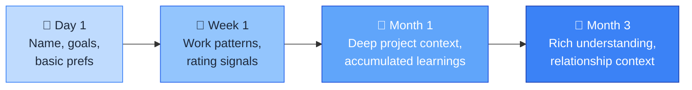

Most AI tools forget everything between conversations. You explain your project on Monday, and by Wednesday you're starting over. Every session begins with the same ritual: re-establishing context, reminding the AI what you're working on, restating your preferences. It's like working with a brilliant colleague who has amnesia.

PAI is designed to work differently — to remember.

## What works today

PAI's memory system has a solid foundation. These capabilities are production-ready:

**Goals and project context.** PAI loads your TELOS files (goals, projects, priorities) at session start. You can reference active projects and PAI knows the context. Your goals inform every interaction.

**Work tracking.** PAI tracks work sessions through PRD files in `MEMORY/WORK/`. When you return to a task, the criteria, decisions, and progress are all there.

**Ratings and feedback signals.** Every rating you give (1-10) is captured to `MEMORY/SIGNALS/ratings.jsonl`. Low ratings trigger learning captures. These signals accumulate and inform future behaviour.

**Learnings.** Significant work sessions capture learnings to `MEMORY/LEARNING/`, organised by domain (SYSTEM, ALGORITHM). These are referenced in future sessions.

**Relationship context.** PAI captures observations and interaction patterns to `MEMORY/RELATIONSHIP/`, building a picture of how you work over time.

**Session context loading.** At session start, the LoadContext hook injects recent work summaries, learning signals, and relationship context. You don't start from zero.

Today, memory works best when you actively participate: tell PAI what to remember, organise your TELOS files, and give ratings consistently. The system captures signals automatically, but the quality of recall depends on how well context is structured.

## Where it's heading

The vision for PAI's memory system goes further than what works today. These capabilities are under active development:

**Automatic preference detection.** PAI will notice that you consistently prefer tables over bullet lists, concise over verbose, and formal over casual -- and adapt without being told. Today, you need to state preferences explicitly or through steering rules.

**Effortless cross-session recall.** The goal is that you can say "that auth bug" three days later and PAI knows exactly which one. Today, this works for recent work tracked in PRDs but is less reliable for casual conversation references.

**Decision memory.** PAI will track past decisions and their outcomes, steering you away from approaches that failed before. Today, significant decisions are captured in learnings, but the recall is not yet systematic.

**Zero-effort context building.** The ideal is that memory requires no manual maintenance -- no curating, no tagging, no reminding. Today, you get the best results by actively managing your TELOS files and memory directory.

## How memory builds over time

PAI gets more useful the longer you use it. Here's what that progression looks like.

**Day 1.** PAI knows your name, your stated goals, and any preferences you shared during setup. It's helpful, but generic.

**Week 1.** PAI has accumulated rating signals from your feedback and captured learnings from significant work sessions. Context loading gets richer.

**Month 1.** PAI knows your projects deeply through TELOS and accumulated work PRDs. Learnings from dozens of sessions inform how it approaches your tasks. Relationship context captures how you prefer to work.

**Month 3.** PAI has a rich understanding built from hundreds of rating signals, dozens of learnings, and extensive relationship context. The gap between starting a session and being productive narrows significantly.

## What to read next

- [Your AI Gets Better](/user/self-improvement/) -- how feedback drives continuous improvement
- [Working With Skills](/user/working-with-skills/) -- what your AI can do
- [Giving Feedback](/user/giving-feedback/) -- how to help PAI learn faster
