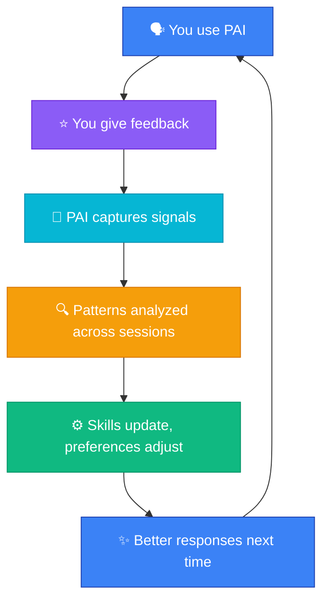

The AI you use after three months is measurably better than the one you started with — because it learned from you.

PAI captures concrete signals from your interactions and uses them to shape how it works for you. Every rating you give feeds into a system that exists to make your experience better.

## What works today

### Explicit ratings

After any response, you can type a number from 1 to 10 to rate how well PAI did. This is the most direct signal you can give. A rating of 3 tells PAI something went wrong. A rating of 9 tells it to keep doing exactly that.

The RatingCapture hook detects your rating and writes it to `MEMORY/SIGNALS/ratings.jsonl`. Low ratings (<6) automatically trigger a learning capture — PAI records the full context of what went wrong so it can reference it in future sessions.

### Implicit sentiment

PAI also reads between the lines. If you respond with "this is completely wrong, I needed the opposite," the RatingCapture hook uses Haiku inference to detect frustration and treats it as a negative signal. Enthusiasm registers as a positive signal.

### How ratings are used

| Signal | What happens today |
|--------|-------------------|
| **Rating 1-3** | Full context captured as learning. Referenced in future session context loading. |
| **Rating 4-6** | Captured to ratings.jsonl. Available in performance trend data. |
| **Rating 7-8** | Captured to ratings.jsonl. Positive signal in trend data. |
| **Rating 9-10** | Captured to ratings.jsonl. Strong positive in trend data. |
| **Detected frustration** | Treated as low-rating signal. Context captured. |

Performance trends (daily, weekly, monthly averages) are loaded into session context at startup, giving PAI awareness of its recent track record.

### Algorithm self-reflection

After every Algorithm run, PAI captures structured reflections to `algorithm-reflections.jsonl`: what should have been done differently, what capabilities were underused, what a better approach would look like. These reflections feed periodic Algorithm upgrades — the MineReflections and AlgorithmUpgrade workflows aggregate patterns and propose changes to the Algorithm specification itself.

## Where it's heading

These capabilities are the design goal but not yet fully realised:

**Automatic pattern detection across sessions.** The vision: if you consistently rate research tasks highly but give lower scores to content generation, PAI identifies that gap and focuses improvement efforts where they matter most. Today, the signals are captured but systematic cross-session pattern analysis is under development.

**Automatic preference adaptation.** The goal: PAI notices you always edit its bullet-point lists into tables, and starts defaulting to tables without being told. Today, you get the best results by stating preferences explicitly or through steering rules in `USER/AISTEERINGRULES.md`.

**Skill-level improvement from evidence.** The vision: accumulated ratings drive automatic improvements to how each skill operates for you. Today, ratings inform context loading but do not yet trigger automatic skill configuration changes.

## Practical examples

Here are scenarios showing how feedback works today and where it's heading.

**Rating with explanation (works today)**
You type `3 -- way too formal, I needed a casual tone for this audience`. PAI captures the rating and the full context as a learning. Next session, if the learning is loaded into context, PAI can reference your tone preference.

**Accumulated rating trends (works today)**
Over several weeks, your ratings average is visible in the performance trend loaded at session start. PAI can see whether it's trending up or down, giving it awareness of its general effectiveness.

**Steering rules for preferences (works today)**
You add `Always use tables instead of bullet lists for structured data` to `USER/AISTEERINGRULES.md`. This takes effect immediately in every session — no need to wait for PAI to infer the preference.

**Automatic adaptation (future)**
Over several sessions, PAI notices you always edit its bullet-point lists into tables. Without you ever saying "I prefer tables," PAI starts defaulting to table format. This automatic inference from behavioural patterns is under development.

## How to give good feedback

The quality of PAI's improvement depends on the quality of your feedback. A few practices make a significant difference.

**Be specific when you rate.** Instead of just typing `4`, type `4 -- the research was good but the conclusion contradicted the evidence`. The explanation gives PAI actionable information about what to change.

**Rate consistently.** If you only rate when you are frustrated, PAI gets a skewed picture. Rate the good responses too -- a quick `8` takes one second and tells PAI what to keep doing.

**Use the full scale.** Some people default to 7 for everything. That tells PAI nothing. Use 3 when something genuinely misses the mark. Use 9 when something genuinely impresses you. The range is there for a reason.

**Ratings of 1-3 trigger the deepest analysis.** If something truly fails, a low rating with an explanation is the single most valuable piece of feedback you can give.

:::note
A 3 with an explanation is more valuable than a silent 7. The explanation gives PAI specific, actionable information about what to change.
:::

## The learning loop

PAI's improvement follows a continuous cycle. Every pass through this loop makes your experience incrementally better.

The system you use after three months is measurably more effective than the one you started with -- not because the underlying AI model changed, but because PAI has built a detailed understanding of what works for you. Your feedback is the engine that drives that improvement.

## What to read next

- [Your AI Remembers](/user/memory/) -- how memory persists across sessions
- [Giving Feedback](/user/giving-feedback/) -- detailed guide on effective feedback
- [Working With Skills](/user/working-with-skills/) -- the skills that improve from your feedback
